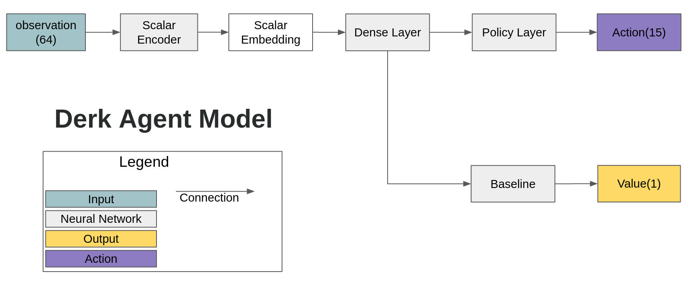

# MOBA_RL
Deep Reinforcement Learning for Multiplayer Online Battle Arena

# Tabel of Content
- [Prerequisite](#prerequisite)
- [Reference](#reference)
- [Derk Environment](#derk-environment)
- [Dota2 Environment](#dota2-environment)
  * [1. Network Architecture](#1-network-architecture)
  * [2. Rendering Environment](#2-rendering-environment)
  * [3. Training Environment](#3-training-environment)
    + [Single Hero Training Result](#single-hero-training-result)
    + [Using Ability to Other Hero](#using-ability-to-other-hero)
- [Detailed Information](#detailed-information)
- [License](#license)

# Prerequisite
1. Python 3
2. tmux
3. gym-derk 
4. Tensorflow 2.4.1
5. TensorFlow Probability 0.11.0
6. Dotaservice of TimZaman
7. Seed RL of Google
8. Ubuntu 20.04
11. No GPU, 30GB RAM Desktop mini Desktop is used to make multiple Dokcer container of Dotaservice
10. GPU, 46GB RAM Desktop is used to make the IMPALA RL agent

# Reference
1. Seed RL: https://github.com/google-research/seed_rl
2. Derk's Gym: https://gym.derkgame.com/ 
3. Dotaservice: https://github.com/TimZaman/dotaservice
4. Dotaclient: https://github.com/TimZaman/dotaclient
5. LastOrder-Dota2: https://github.com/bilibili/LastOrder-Dota2

# Derk Environment
We are going to train small MOBA environment called [Derk](https://gym.derkgame.com/).


First, move to [dr-derks-mutant-battlegrounds folder](https://github.com/kimbring2/MOBA_RL/tree/main/dr-derks-mutant-battlegrounds).



Run below command to run the 50 parallel environemnt. I modified [Seel_RL](https://github.com/google-research/seed_rl) of Google for my MOBA case. 

```
$ python learner_1.py --workspace_path [your path]/dr-derks-mutant-battlegrounds/
$ python learner_2.py --workspace_path [your path]/dr-derks-mutant-battlegrounds/
$ python run.py -p1 bot -p2 oldbot -n 50
```

You can check the training progress using Tensorboard log under tboard path of workspace.


After training, one team choose to attack the opponent and the other team choose to defend.

[](https://www.youtube.com/watch?v=avQra5Wt-wI "Derk video - Click to Watch!")
<strong>Click to Watch!</strong>

# Dota2 Environment
In the case of Derk environment, you can render game and train agent at the same time on one PC. However, in the case of dota2, PC for rendering and a PC for training are required separately because of large size of network and game, and multiple docker containers. Additionally, I use the same user name for the rendering pc and the training pc for the convenience of path setting.  

## 1. Network Architecture
Unlike network for Derk game, which consists of one for observation processing and one for action selecting network, Dota2 agent needs a 6 observation processing networks and 5 action processing networks due to the large size of the game.


Furthermore, each hero has different kind of ability. Some abilities need to be activated by user or other abilities are just passive. That means action part of network structure also should be different from hero to here. 


In the case of Shadowfiend which has 4 non passive abilities, ability action network has 4 output. For Omniknight case, network output is three.


## 2. Rendering Environment
You first need to install Dota 2 from Steam. After installation, please check there is Dota2 folder under /home/[your account]/.steam/steam/steamapps/common/dota 2 beta'. We are going to run Dota2 from terminal command.

Next, you need to download and install [dotaservice](https://github.com/TimZaman/dotaservice). In my case, I should modity the _run_dota function of [dotaservice.py](https://github.com/TimZaman/dotaservice/blob/master/dotaservice/dotaservice.py) like below.

```
async def _run_dota(self):
  script_path = os.path.join(self.dota_path, self.DOTA_SCRIPT_FILENAME)
  script_path = '/home/[your user name]/.local/share/Steam/ubuntu12_32/steam-runtime/run.sh'

  # TODO(tzaman): all these options should be put in a proto and parsed with gRPC Config.
  args = [
       script_path,
       '/home/[your user name]/.local/share/Steam/steamapps/common/dota 2 beta/game/dota.sh',
       '-botworldstatesocket_threaded',
       '-botworldstatetosocket_frames', '{}'.format(self.ticks_per_observation),
       '-botworldstatetosocket_radiant', '{}'.format(self.PORT_WORLDSTATES[TEAM_RADIANT]),
       '-botworldstatetosocket_dire', '{}'.format(self.PORT_WORLDSTATES[TEAM_DIRE]),
       '-con_logfile', 'scripts/vscripts/bots/{}'.format(self.CONSOLE_LOG_FILENAME),
       '-con_timestamp',
       '-console',
       '-dev',
       '-insecure',
       '-noip',
       '-nowatchdog',  # WatchDog will quit the game if e.g. the lua api takes a few seconds.
       '+clientport', '27006',  # Relates to steam client.
       '+dota_1v1_skip_strategy', '1',
       '+dota_surrender_on_disconnect', '0',
       '+host_timescale', '{}'.format(self.host_timescale),
       '+hostname dotaservice',
       '+sv_cheats', '1',
       '+sv_hibernate_when_empty', '0',
       '+tv_delay', '0',
       '+tv_enable', '1',
       '+tv_title', '{}'.format(self.game_id),
       '+tv_autorecord', '1',
       '+tv_transmitall', '1',  # TODO(tzaman): what does this do exactly?
  ]
```

If you enter the following command after modification, the Dota2 game will be launched.

```
$ python -m dotaservice
$ python env_test.py --render True
```

Dota 2 should be successfully launched and the hero selection screen should appear. When entering the main game, you can then use \ key to pop up the console. Then, try use the 'jointeam spec' command to see the hero, tower of entire map.

[](https://www.youtube.com/watch?v=GzILbfRFnZE "Dota2 launch test video - Click to Watch!")
<strong>Click to Watch!</strong>

Now, you are ready to train Dota2 with Seed RL just as we did in the Derk game. Try to run Seed RL and Dota2 together on the rendering PC with the following command. The hero behaves randomly because model does not be trained yet.

```
$ python -m dotaservice
$ python learner_dota.py
$ python run.py --render True
```

To see proper behavior, you need to put the weight trained on training PC in the [model](https://github.com/kimbring2/MOBA_RL/tree/main/dota2/model) folder.

## 3. Training Environment
Unlike Derk game, each Dotaservice occupies more than 1GB of memory. Therefore, it is good to run them separately on a mini PC without a GPU. Then, Learner and Actor of IMPALA RL need to be ran on a PC with a GPU.

You need to build the Docker image of Dotaservice mentioned in [README](https://github.com/TimZaman/dotaservice/blob/master/docker/README.md).  


First, you need to run the Docker containers of Dotaservice using below command on no GPU pc.
```
$ ./run_dotaservice.sh 16
```

Next, you need to run the IMPALA RL at GPU PC using below command.
```
$ ./run_impala.sh 16
```

Addidinally, you can terminate both process using below command.
```
$ ./stop.sh
```

If you search through the tmux, you can see that 16 dotaservices is ran in one terminal and the other terminal runs 1 learner and 16 actors.


Run below command to see Tensorboard log of training PC from rendeirng PC remotely.

```
tensorboard --host 0.0.0.0 --logdir=./tensorboard
```

### Single Hero Training Result
In the case of 1V1MID game mode, which is the most basic type, you can confirm that training was done properly based on the reward graph.


After finishing training, you need a trained model from training pc to rendering pc. Please copy it to the model folder and run below command at terminal.

```
$ python -m dotaservice
$ python learner_dota.py
$ python run.py --render True
```

On the rendering PC, you can check the training result better than the graph as shown in the video below. The hero learns how to move to mid area and attack enermy creep.

[](https://www.youtube.com/watch?v=uc1Zyvg-jl0 "Dota2 single hero training video - Click to Watch!")
<strong>Click to Watch!</strong>
 
# Detailed information
I am writing explanation for code at Medium as series.

1. Training simple MOBA using DRL: https://medium.com/codex/playing-moba-game-using-deep-reinforcement-learning-part-1-106e60aa4110
2. Using detailed function of Dota2: https://dohyeongkim.medium.com/playing-moba-game-using-deep-reinforcement-learning-part-2-a31573b0a48d

# License
MIT License
