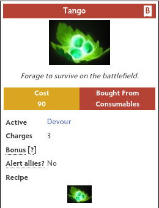
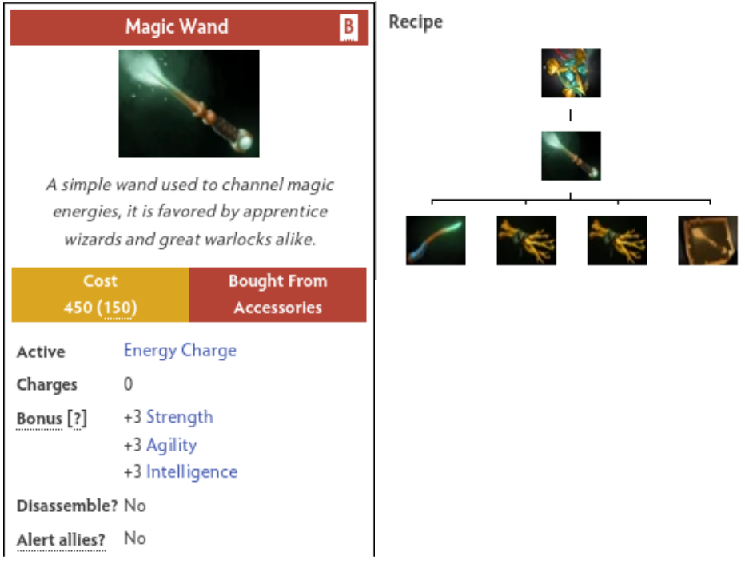
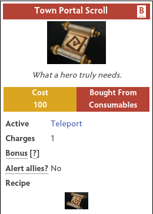
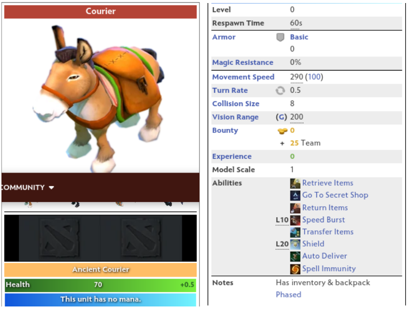
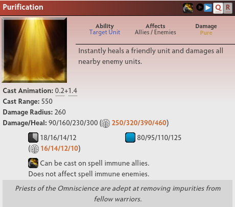

# MOBA_RL
Deep Reinforcement Learning for Multiplayer Online Battle Arena

# Tabel of Content
- [Prerequisite](#prerequisite)
- [Reference](#reference)
- [Derk Environment](#derk-environment)
- [Dota2 Environment](#dota2-environment)
  * [1. Network Architecture](#1-network-architecture)
  * [2. Rendering Environment](#2-rendering-environment)
  * [3. Training Environment](#3-training-environment)
    + [Single Hero Training Result](#single-hero-training-result)
  * [4. Ability and Item](#4-ability-and-item)
    + [Buying and Using Item](#buying-and-using-item)
    + [Learning and Using Ability](#learning-and-using-ability)
    + [Upgrading Item](#upgrading-item)
    + [Using Town Portar Scroll](#using-town-portar-scroll)
    + [Using the Courier](#using-the-courier)
    + [Using Ability to Other Hero](#using-ability-to-other-hero)

# Prerequisite
1. Python 3
2. tmux
3. gym-derk 
4. Tensorflow 2.4.1
5. TensorFlow Probability 0.11.0
6. Dotaservice of TimZaman
7. Seed RL of Google
8. Ubuntu 20.04
11. No GPU, 30GB RAM Desktop mini Desktop is used to make multiple Dokcer container of Dotaservice
10. GPU, 46GB RAM Desktop is used to make the IMPALA RL agent

# Reference
1. Seed RL: https://github.com/google-research/seed_rl
2. Derk's Gym: https://gym.derkgame.com/ 
3. Dotaservice: https://github.com/TimZaman/dotaservice
4. Dotaclient: https://github.com/TimZaman/dotaclient
5. LastOrder-Dota2: https://github.com/bilibili/LastOrder-Dota2

# Derk Environment
We are going to train small MOBA environment called [Derk](https://gym.derkgame.com/).


First, move to [dr-derks-mutant-battlegrounds folder](https://github.com/kimbring2/MOBA_RL/tree/main/dr-derks-mutant-battlegrounds).


Run below command to run the 50 parallel environemnt. I modified [Seel_RL](https://github.com/google-research/seed_rl) of Google for my MOBA case. 

```
$ python learner_1.py --workspace_path [your path]/dr-derks-mutant-battlegrounds/
$ python learner_2.py --workspace_path [your path]/dr-derks-mutant-battlegrounds/
$ python run.py -p1 bot -p2 oldbot -n 50
```

You can check the training progress using Tensorboard log under tboard path of workspace.


After training, one team choose to attack the opponent and the other team choose to defend.

[](https://www.youtube.com/watch?v=avQra5Wt-wI "Derk video - Click to Watch!")
<strong>Click to Watch!</strong>

# Dota2 Environment
In the case of Derk environment, you can render game and train agent at the same time on one PC. However, in the case of dota2, PC for rendering and a PC for training are required separately because of large size of network and game, and multiple docker containers. Additionally, I use the same user name for the rendering pc and the training pc for the convenience of path setting.  

## 1. Network Architecture
Unlike network for Derk game, which consists of one for observation processing and one for action selecting network, Dota2 agent needs a 6 observation processing networks and 5 action processing networks due to the large size of the game.


## 2. Rendering Environment
You first need to install Dota 2 from Steam. After installation, please check there is Dota2 folder under /home/[your account]/.steam/steam/steamapps/common/dota 2 beta'. We are going to run Dota2 from terminal command.

Next, you need to download and install [dotaservice](https://github.com/TimZaman/dotaservice). In my case, I should modity the _run_dota function of [dotaservice.py](https://github.com/TimZaman/dotaservice/blob/master/dotaservice/dotaservice.py) like below.

```
async def _run_dota(self):
  script_path = os.path.join(self.dota_path, self.DOTA_SCRIPT_FILENAME)
  script_path = '/home/[your user name]/.local/share/Steam/ubuntu12_32/steam-runtime/run.sh'

  # TODO(tzaman): all these options should be put in a proto and parsed with gRPC Config.
  args = [
       script_path,
       '/home/[your user name]/.local/share/Steam/steamapps/common/dota 2 beta/game/dota.sh',
       '-botworldstatesocket_threaded',
       '-botworldstatetosocket_frames', '{}'.format(self.ticks_per_observation),
       '-botworldstatetosocket_radiant', '{}'.format(self.PORT_WORLDSTATES[TEAM_RADIANT]),
       '-botworldstatetosocket_dire', '{}'.format(self.PORT_WORLDSTATES[TEAM_DIRE]),
       '-con_logfile', 'scripts/vscripts/bots/{}'.format(self.CONSOLE_LOG_FILENAME),
       '-con_timestamp',
       '-console',
       '-dev',
       '-insecure',
       '-noip',
       '-nowatchdog',  # WatchDog will quit the game if e.g. the lua api takes a few seconds.
       '+clientport', '27006',  # Relates to steam client.
       '+dota_1v1_skip_strategy', '1',
       '+dota_surrender_on_disconnect', '0',
       '+host_timescale', '{}'.format(self.host_timescale),
       '+hostname dotaservice',
       '+sv_cheats', '1',
       '+sv_hibernate_when_empty', '0',
       '+tv_delay', '0',
       '+tv_enable', '1',
       '+tv_title', '{}'.format(self.game_id),
       '+tv_autorecord', '1',
       '+tv_transmitall', '1',  # TODO(tzaman): what does this do exactly?
  ]
```

If you enter the following command after modification, the Dota2 game will be launched.

```
$ python -m dotaservice
$ python env_test.py --render True
```

Dota 2 should be successfully launched and the hero selection screen should appear. When entering the main game, you can then use \ key to pop up the console. Then, try use the 'jointeam spec' command to see the hero, tower of entire map.

[](https://www.youtube.com/watch?v=GzILbfRFnZE "Dota2 launch test video - Click to Watch!")
<strong>Click to Watch!</strong>

Now, you are ready to train Dota2 with Seed RL just as we did in the Derk game. Try to run Seed RL and Dota2 together on the rendering PC with the following command. The hero behaves randomly because model does not be trained yet.

```
$ python -m dotaservice
$ python learner_dota.py
$ python run.py --render True
```

To see proper behavior, you need to put the weight trained on training PC in the [model](https://github.com/kimbring2/MOBA_RL/tree/main/dota2/model) folder.

## 3. Training Environment
You need to build the Docker image of Dotaservice mentioned in [README](https://github.com/TimZaman/dotaservice/blob/master/docker/README.md) of Docker of the dotaservice.

Unlike Derk game, each Dotaservice occupies more than 1GB of memory. Therefore, it is good to run them separately on a mini PC without a GPU. Then, Learner and Actor of IMPALA RL need to be ran on a PC with a GPU.


You can run the Seel RL for Dota2 using below command.
```
$ ./run_dotaservice.sh 16
$ ./run_impala.sh 16
```

Addidinally, you can terminate all process using below command.
```
$ ./stop.sh
```
If you search through the tmux, you can see that 16 dotaservices is ran in one terminal and the other terminal runs 1 learner and 16 actors.


Run below command to see Tensorboard log of training PC from rendeirng PC remotely.

```
tensorboard --host 0.0.0.0 --logdir=./tensorboard
```

### Single Hero Training Result
In the case of 1V1MID game mode, which is the most basic type, you can confirm that training was done properly based on the reward graph.


After finishing training, you need a trained model from training pc to rendering pc. Please copy it to the model folder and run below command at terminal.

```
$ python -m dotaservice
$ python learner_dota.py
$ python run.py --render True
```

On the rendering PC, you can check the training result better than the graph as shown in the video below. The hero learns how to move to mid area and attack enermy creep.

[](https://www.youtube.com/watch?v=uc1Zyvg-jl0 "Dota2 single hero training video - Click to Watch!")
<strong>Click to Watch!</strong>

## 4. Ability and Item
Unlike the Derk game, where items and ability are chosen at the start of game, the hero of Dota2 can improve the them gradually during the playing time.


Therefore, hero need to decide what abilities and items to buy when leveling up or collecting ma certain amount of gold. The Rule Based method is used for that part because there is no suitable Learning-Based method can deal with it.

### Buying and Using Item
Unlike the Derk game, where items are given at the start, the hero of Dota2 must visit the item store to purchase the item. I will explain how to write Lua script for that because the dotaservice lacks this part.

The Tango that is most basic item can be purchased at the store when start of game. Hero can use it on the surrounding trees to regenerate the health. Let's see how to write a code this item.



To add the ability to purchase and use items, you must first add a below code line to the [action_processor.lua](https://github.com/TimZaman/dotaservice/blob/master/dotaservice/lua/action_processor.lua) of dotaservice.

```
local purchaseItem = require( "bots/actions/purchase_item" )
```

Then add the following line to the [bot_generic.lua](https://github.com/TimZaman/dotaservice/blob/master/dotaservice/lua/bot_generic.lua) file.

```
elseif action.actionType == "DOTA_UNIT_ORDER_PURCHASE_ITEM" then
        action_table[action.actionType] = {{action.purchaseItem.item}, {action.purchaseItem.itemName}}
```

Finally, make the purchase_item.lua file to your [actions](https://github.com/TimZaman/dotaservice/tree/master/dotaservice/lua/actions) folder and copy the following content.

```
local PurchaseItem = {}

PurchaseItem.Name = "Purchase Item"
PurchaseItem.NumArgs = 2

local tableItemsToBuy = { "item_tango", "item_tango"};

----------------------------------------------------------------------------------------------------

function PurchaseItem:Call( hUnit, item_name )
	if ( #tableItemsToBuy == 0 )
	then
		hUnit:SetNextItemPurchaseValue( 0 );
		return;
	end

	local sNextItem = "item_tango"
  
	hUnit:SetNextItemPurchaseValue( GetItemCost( sNextItem ) );
	if ( hUnit:GetGold() >= GetItemCost( sNextItem ) )
	then
		hUnit:ActionImmediate_PurchaseItem( sNextItem );
		table.remove( tableItemsToBuy, 1 );
	end

end

----------------------------------------------------------------------------------------------------
return PurchaseItem
```

Lua script for item can be used in Python as below code. If you put this part at the beginning of the game, the hero is able to battle more long time.

```
i = CMsgBotWorldState.Action.PurchaseItem()
i.item = 0
i.item_name = "item_tango"

action_pb = CMsgBotWorldState.Action()
action_pb.actionType = CMsgBotWorldState.Action.Type.Value('DOTA_UNIT_ORDER_PURCHASE_ITEM')
action_pb.player = 0
action_pb.purchaseItem.CopyFrom(i) 
```

As explained above, Tango items can be used for tree object. The fastest way for that is to find the closest tree near hero and use it as the target. To implement this method, you need to change the contents of the [use_ability_on_tree.lua](https://github.com/TimZaman/dotaservice/blob/master/dotaservice/lua/actions/use_ability_on_tree.lua) file little bit.

```
local UseAbilityOnTree = {}

UseAbilityOnTree.Name = "Use Ability On Tree"
UseAbilityOnTree.NumArgs = 4

-------------------------------------------------
function UseAbilityOnTree:Call( hUnit, intAbilitySlot, intTree, iType )
    local hItem_1 = hUnit:GetItemInSlot(0)
    local hAbility = hUnit:GetAbilityInSlot(intAbilitySlot[1])
    if not hAbility then
        print('[ERROR]: ', hUnit:GetUnitName(), " failed to find ability in slot ", intAbilitySlot[1])
        do return end
    end

    intTree = intTree[1]
    iType = iType[1]

    -- Note: we do not test if the tree can be ability-targeted due to
    -- range, mana/cooldowns or any debuffs on the hUnit (e.g., silenced).
    -- We assume only valid and legal actions are agent selected
    local tableNearbyTrees = hUnit:GetNearbyTrees(500);
    if tableNearbyTrees[1] then
        intTree = tableNearbyTrees[1]
    end

    local vLoc = GetTreeLocation(intTree)

    DebugDrawCircle(vLoc, 25, 255, 0, 0)
    DebugDrawLine(hUnit:GetLocation(), vLoc, 255, 0, 0)

    hAbility = hItem_1
    if iType == nil or iType == ABILITY_STANDARD then
        hUnit:Action_UseAbilityOnTree(hAbility, intTree)
    elseif iType == ABILITY_PUSH then
        hUnit:ActionPush_UseAbilityOnTree(hAbility, intTree)
    elseif iType == ABILITY_QUEUE then
        hUnit:ActionQueue_UseAbilityOnTree(hAbility, intTree)
    end
end
-------------------------------------------------

return UseAbilityOnTree
```

The trees around hero can be found using the GetNearbyTrees function of Lua. You need to give a 0 as an index for the GetItemInSlot function because the Tango is stored at the first place of the hero slot.

Just like buying a Tango item, you can use the Tango item as in the code below after implementing the Lua script.

```
t = CMsgBotWorldState.Action.CastTree()
t.abilitySlot = 0
t.tree = 50

action_pb = CMsgBotWorldState.Action()
action_pb.actionType = CMsgBotWorldState.Action.Type.Value('DOTA_UNIT_ORDER_CAST_TARGET_TREE')
action_pb.player = 0
action_pb.castTree.CopyFrom(t) 
```

After implementing all of the above Lua scripts, hero can purchase and use Tango items like a below video.

[](https://www.youtube.com/watch?v=-Alt7TSRZVg "Dota2 Tango item video - Click to Watch!")
<strong>Click to Watch!</strong>

### Learning and using ability
Unlike the Derk game, where ability are given at the start, the hero of Dota2 must learn the ability to use it. Furthermore, the method of selecting the target for each ability is slightly different. Target can be nothing, unit, and tree.


The Shadowraze does not require the target. Therefore, we need to write the code as follows.

```
action_pb = CMsgBotWorldState.Action()
action_pb.actionType = CMsgBotWorldState.Action.Type.Value('DOTA_UNIT_ORDER_CAST_NO_TARGET')
action_pb.player = 0
```

It would best to use that ability when an enemy hero or creep is within range of it like a below video. 

[](https://www.youtube.com/watch?v=OVScU7aLEpk "Dota2 Shadowraze ability video - Click to Watch!")
<strong>Click to Watch!</strong>

## 6. Upgrading item
Unlike the Derk game, where item are not changed until end of game, the hero of Dota2 can upgrade low level items to high level one by using recipe system.

For example, in the case of the Magic Stick, which is a very early game, it can be upgraded to the Magic Wand by using 2 Iron Branch and 1 Recipe like a below image.



When implementing that as Python code, you can just save the item name in the list and use that as sequently for purchasing each item.

```
item_buy_flag = 0

init_item = [
              'item_magic_stick', 'item_branches', 'item_branches', 'item_recipe_magic_wand'
            ]  
	    
if item_buy_flag != len(init_item):
  action_pb.actionType = CMsgBotWorldState.Action.Type.Value('DOTA_UNIT_ORDER_PURCHASE_ITEM')
  action_pb.player = 0

  i = CMsgBotWorldState.Action.PurchaseItem()
  i.item = 2
  i.item_name = init_item[item_buy_flag]

  action_pb.purchaseItem.CopyFrom(i) 
  item_buy_flag += 1
```

The video below shows how to use the above code to acquire a magic wand.

[](https://www.youtube.com/watch?v=EbCzKKf4aao "Dota2 upgrade item video - Click to Watch!")
<strong>Click to Watch!</strong>

### Using Town Portar Scroll
Unlike the Derk game, where map size small, the range of Dota2 between starting and battle point are long. Therefore, the hero should use the Town Portal scroll to join and exit from battle. 



In the case of Town Portar scroll, it is given at start of game, and it is stored in the 15th slot of inventory. After using it, hero can buy it from store using gold. The Python code for using it is like below.

```
action_pb.actionDelay = 0 
action_pb.player = 0 
action_pb.actionType = CMsgBotWorldState.Action.Type.Value('DOTA_UNIT_ORDER_CAST_POSITION')

action_pb.castLocation.abilitySlot = -16
action_pb.castLocation.location.x = -6700
action_pb.castLocation.location.y = -6700
action_pb.castLocation.location.z = 0
```

[](https://www.youtube.com/watch?v=rudbbEhshIw "Dota2 use teloport scroll video - Click to Watch!")
<strong>Click to Watch!</strong>

### Using the Courier
Unlike the Derk game, where map size small, the range of Dota2 between starting and battle point are long. Therefore, the hero of battle point can use the Courier to obtain the items without moving to starting point.



If hero purchase an item when there is no store around, that item in stored under stash. Below Python code is for transfering that items to the Courier.

```
action_pb.player = 0 
action_pb.actionType = CMsgBotWorldState.Action.Type.Value('ACTION_COURIER')

action_pb.courier.unit = 0 
action_pb.courier.courier = 0
action_pb.courier.action = 6
```

After taking the stash items, Courier can give them to hero by using below Python code:

```
action_pb.player = 0 
action_pb.actionType = CMsgBotWorldState.Action.Type.Value('ACTION_COURIER')

action_pb.courier.unit = 0 
action_pb.courier.courier = 0
action_pb.courier.action = 3
```

Below video shows how the hero of battle point obtains an item without moving to the starting point using Courier.

[](https://www.youtube.com/watch?v=xSvZRYFXErg "Dota2 use courier video - Click to Watch!")
<strong>Click to Watch!</strong>

### Using Ability to Other Hero
In MOBA games, there is a hero who is mainly in charge of attacks, and there is a hero who assists it. Mainly units with abilities such as HP recovery and shield generation can take that position. 



To use the HP recovery ability for the first hero, you can use the below code.

```
for unit in response.world_state.units:
  if unit.unit_type == CMsgBotWorldState.UnitType.Value('HERO'):
    if unit.team_id == TEAM_RADIANT and unit.player_id == 0:
      hero1_unit = unit
    elif unit.team_id == TEAM_RADIANT and unit.player_id == 1:
      hero2_unit = unit

action_pb2.actionType = CMsgBotWorldState.Action.Type.Value('DOTA_UNIT_ORDER_CAST_TARGET')
action_pb2.castTarget.abilitySlot = 1
action_pb2.castTarget.target = hero1_unit.handle

actions = []
for i in range(0, 1):
  action_pb1.player = 0
  actions.append(action_pb1)

for i in range(0, 1):
  action_pb2.player = 1
  actions.append(action_pb2)

actions_pb = CMsgBotWorldState.Actions(actions=actions)
```

The following shows an example of recovering HP of same team hero.

[](https://www.youtube.com/watch?v=xSvZRYFXErg "Dota2 use use purification video - Click to Watch!")
<strong>Click to Watch!</strong>
